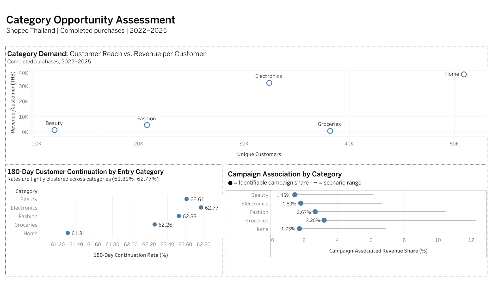

# Category Opportunity Assessment — Shopee Thailand

## 1. Project Overview

**Why I chose this project**
I wanted to build a portfolio project that reflects how business analysis works in practice, rather than simply demonstrating SQL skills. Instead of answering a predefined question with a few queries, I wanted to work through the process of defining an ambiguous business problem, making decisions about metric definitions, validating assumptions against the data, and distinguishing evidence from interpretation.

**Business context**
For a multi-category e-commerce platform, an ongoing business question is which categories show signals worth further attention. That decision cannot be reduced to a single metric: customer reach, growth, repeat purchasing behavior, and the role of campaigns can each tell a different part of the story.

**Dataset**
This project uses the Shopee Thailand Customer Journey & Operations dataset, consisting of 11 CSV tables covering customers, orders, order items, products, campaigns, product-campaign links, sellers, shipments, and website/session activity. I built an order-item-level analytical base from orders, order items, and products, then used the campaign tables to assess campaign association.

**What I wanted to find**
I assessed five product categories (Home, Groceries, Electronics, Fashion, Beauty) across three complementary lenses:
- **Demand** — current customer reach and momentum over time
- **Continuation** — whether customers who first purchased a category returned to make another purchase on the platform within 180 days
- **Campaign association** — how much category revenue was associated with identifiable campaigns

The goal was not to produce a single category score, but to identify which categories showed the strongest and most distinctive signals for further consideration.

**Scope**
I deliberately focused on these three behavioral and commercial lenses. Profitability, external market size, competitive landscape, and cross-border feasibility were treated as follow-up questions rather than estimated from data that could not reliably support them.

---

## 2. Business Question

**Primary Question:**
Which product categories on Shopee Thailand show the strongest behavioral signals for cross-border expansion consideration?

**Supporting Question:**
What data limitations and risks must be acknowledged before translating these signals into a broader market decision?

**Why this framing:**
This analysis uses platform-internal transaction data only — no external market size, competitor presence, or consumer survey data is available. The dataset can show *signals* such as purchasing patterns, revenue concentration, and customer continuation, but it cannot confirm the size or attractiveness of a broader market opportunity. I therefore kept the question focused on what the transaction data can actually support.

Category was chosen as the primary lens over geography because the dataset provides richer, more reliable signals at the category level — product attributes, campaign association, and repeat purchase behavior are all categorized but only sparsely linked to province-level demand patterns.

---

## 3. Data & Tools

- **Dataset:** Shopee Thailand Customer Journey & Operations Dataset — 11 CSV tables of simulated e-commerce transaction and customer-journey data.
- **Core analytical tables:** `order_items`, `orders`, and `products`, joined into a single `analysis_base` table at order-item grain.
- **Campaign analysis:** Campaign status was derived from `is_campaign` and `product_campaign_id` in `order_items`. Campaign reference tables were validated but were not required for the core revenue-share calculation.
- **Validation:** `shipments` was used to validate which order statuses represented fulfilled purchases. This led to the use of Completed-only transactions across all three analytical lenses.
- **Tables reviewed but excluded:** `reviews` and `website_sessions` / `session_activities`. Reviews contained text but no rating field and would have required a separate NLP scope; session data was used only for funnel sanity checks.
- **Time period:** January 2022 – December 2025
- **Data scale:** ~480K order items, ~300K orders, ~4,880 products, across five categories
- **SQL:** MySQL — CTEs, window functions, joins, and correlated subqueries
- **Scope:** The analysis focused on the three data dimensions directly relevant to the business question: category demand, customer continuation, and campaign association. Other available data was deliberately excluded rather than used simply for completeness.

---

## 4. Analytical Approach

**Data Foundation**
The analysis is built on an `analysis_base` table joining three source tables — order items, orders, and products — filtered to `item_status = 'Completed'` only. Cancelled orders (~20%) and refunded orders (~5%) are excluded to ensure the analysis reflects realized purchasing behavior, not intent.

**Three Analytical Lenses**

The analysis evaluates each category across three dimensions:

**Demand** — Total revenue and unique customer count per category, measured as platform penetration rate (category customers ÷ total platform customers per year) rather than absolute revenue growth. This controls for the platform's 6.6× overall growth between 2022 and 2025; a category growing in absolute terms may still be losing relative ground if the platform is growing faster.

**Continuation** — The share of first-time category buyers who return to purchase again within 180 days. The window was chosen based on observed purchase gap distributions in the data (median gap: 94 days; 75th percentile: 185 days), making 180 days a data-grounded threshold that captures the natural re-purchase cycle for most customers.

**Campaign Sensitivity** — The proportion of category revenue associated with campaign activity, expressed as a three-point range (lower bound / identifiable only / upper bound) because some campaign-flagged transactions cannot be traced to a campaign ID. I use this as a measure of observed campaign association, not as proof of campaign impact or organic demand.

I looked at the three lenses together because no single metric was enough to separate the categories. A large category, for example, may not have stronger continuation, while a smaller category may show relatively little association with traceable campaigns.

---

## 5. Key Findings

**Demand — Category Scale and Customer Value Look Very Different**

Home is the largest category by both customer count (50,883) and total revenue (฿1.9B), with ฿37,454 in revenue per customer. Electronics has 32,376 customers — about 36% fewer than Home — but still generates ฿1.0B, with ฿31,939 in revenue per customer. Groceries shows the opposite pattern: it has the second-largest customer base (38,168), but only ฿15M in revenue and ฿400 per customer. In other words, customer reach alone does not translate into high category value.

**Continuation — The Categories Are Almost Identical**

The 180-day continuation rates are very close across all five categories: 61.31% for Home at the low end and 62.77% for Electronics at the high end. With a spread of less than 1.5 percentage points, continuation does not meaningfully separate the categories in this dataset. I therefore treat it as context rather than a deciding factor.

**Campaign Sensitivity — Traceable Campaign Association Differs by Category**

The identifiable campaign share ranges from 1.45% for Beauty to 3.20% for Groceries. Electronics (1.80%) and Home (1.73%) are also at the lower end. This tells me that observed revenue in Beauty, Electronics, and Home was less associated with campaigns that could be traced in the dataset. It does not prove that the remaining demand was organic, because campaign attribution is incomplete.

**Cross-Category Implication**

For a cross-border use case, Groceries raises an obvious economics question because revenue per customer is only ฿400. The dataset does not contain the logistics cost needed to decide whether the category is viable, so I would treat this as a reason for further validation rather than a conclusion. Electronics and Beauty raise different follow-up questions because their observed campaign association is relatively low.

---

## 6. Dashboard



[View the interactive dashboard on Tableau Public](https://public.tableau.com/app/profile/niwadee.khommee/viz/CategoryOpportunityAssessment-ShopeeThailand/1)

The dashboard brings the three analytical lenses together: demand, 180-day customer continuation, and campaign association.

---

## 7. Category Signals

| Category | Customers | Total Revenue | Rev/Customer | Continuation (180d) | Campaign Share (identifiable) | Signal Summary |
|---|---:|---:|---:|---:|---:|---|
| Home | 50,883 | ฿1,905,768,258 | ฿37,454 | 61.31% | 1.73% | High demand, high value, low campaign association |
| Electronics | 32,376 | ฿1,034,049,408 | ฿31,939 | 62.77% | 1.80% | High value, highest continuation, low campaign association |
| Fashion | 20,778 | ฿87,826,012 | ฿4,227 | 62.53% | 2.67% | Mid-tier value, moderate campaign association |
| Groceries | 38,168 | ฿15,249,827 | ฿400 | 62.26% | 3.20% | High customer count, very low value, highest campaign association |
| Beauty | 12,005 | ฿12,407,558 | ฿1,034 | 62.61% | 1.45% | Smallest base, lowest identifiable campaign association |

**Reading the signals:**
- **Home & Electronics** — large revenue contribution and relatively low identifiable campaign association; continuation is similar to the other categories
- **Beauty** — small customer base, but the lowest identifiable campaign association
- **Fashion** — sits between the larger and smaller categories without a particularly distinctive signal in these three lenses
- **Groceries** — broad customer reach but very low revenue per customer; its higher campaign association and cross-border economics would need further investigation

---

## 8. Recommendation

**Where I Would Investigate Next: Electronics and Beauty**

Based on these internal platform signals, Electronics and Beauty are the two categories I would investigate further for a cross-border use case. This is a shortlist for the next stage of analysis, not a market-entry decision.

**Electronics** stands out mainly because of customer value. It generates ฿31,939 in revenue per customer while maintaining a relatively large customer base. Its continuation rate is the highest of the five categories (62.77%), although the difference from the other categories is too small to treat as a strong differentiator. Its identifiable campaign share is also low at 1.80%. Together, these signals make Electronics worth testing against external market size, competition, and logistics data.

**Beauty** is interesting for a different reason. It has the smallest customer base (12,005), so the internal demand signal is still limited. However, it also has the lowest identifiable campaign association (1.45%). I would not interpret that as proof of organic demand, but it is enough to make Beauty worth checking against external category demand and competition before ruling it out based on scale alone.

**Categories Not Prioritized**

Home has the highest absolute revenue and remains relevant for future analysis, particularly if logistics and profitability data become available. Fashion does not show a particularly distinctive pattern in the three lenses used here. Groceries has a large customer base but only ฿400 in revenue per customer, so I would first test shipping economics and product mix before considering it further.

**Important Caveat**

This recommendation is based on platform-internal signals only. Before any market decision, additional validation is needed: external market size data, competitive landscape, regulatory and logistics feasibility for each category, and consumer research beyond transaction behavior. These signals suggest *where to look further* — not where to commit.

---

## 9. Limitations

**Data Scope — Platform-Internal Only**
This analysis draws exclusively from Shopee Thailand transaction data. No external data sources — market size estimates, competitor activity, consumer surveys, or macroeconomic indicators — were incorporated. Findings describe purchasing behavior within the platform, not the broader Thai market or cross-border demand potential.

**Causal Claims Cannot Be Made**
The analysis identifies associations and behavioral patterns, not causes. Low campaign association does not prove organic demand, and the continuation metric does not tell me whether customers are loyal to the category or simply continue shopping on Shopee. I therefore use these results as signals for further investigation.

**Campaign Attribution Is Incomplete**
Campaign-associated revenue is identified through `product_campaign_id` linkage. A portion of order items flagged as campaign-associated (`is_campaign = 1`) could not be traced to a specific campaign ID, creating an attribution gap. The three-point sensitivity range (lower / identifiable / upper bound) accounts for this uncertainty but does not resolve it.

**Continuation Window Is an Approximation**
The 180-day repeat purchase window is data-grounded (75th percentile of observed purchase gaps = 185 days) but remains a threshold choice. A different window would produce different continuation rates. Because the five observed rates are already very close, I avoid putting weight on their exact ranking.

**No Competitive or Logistics Context**
The analysis cannot speak to category-level competition in target cross-border markets, import regulations, or logistics feasibility — all of which are necessary inputs before any market entry decision.

---

## 10. SQL & Methodology

**Overview**

All queries run in MySQL against a shared `analysis_base` table built at order-item grain. The analysis proceeds in four stages: base table construction, demand measurement, continuation measurement, and campaign association measurement.

---

**Stage 1 — Build the Analytical Base**

Joins order items, orders, and products into a single table. Campaign fields (`is_campaign`, `product_campaign_id`) are included at this stage so all three lenses share one consistent grain without additional joins.

```sql
CREATE TABLE analysis_base AS
SELECT
    oi.order_item_id, oi.order_id, o.customer_id, o.order_date,
    oi.product_id, p.category, oi.line_total, oi.item_status,
    oi.is_campaign, oi.product_campaign_id
FROM shopee_order_items_thailand AS oi
LEFT JOIN shopee_orders_thailand AS o ON oi.order_id = o.order_id
LEFT JOIN shopee_products_thailand AS p ON oi.product_id = p.product_id;
```

*All lenses filter to `item_status = 'Completed'` — validated against the shipments table: Completed items have 100% shipment coverage; Cancelled and Refunded both have 0%.*

---

**Stage 2 — Demand: Scale and Penetration**

Customer reach and revenue per category, then annual penetration rate (category customers ÷ total active platform customers) to control for 6.6× platform-wide growth between 2022 and 2025.

```sql
-- Scale
SELECT category, COUNT(DISTINCT customer_id) AS unique_customers, SUM(line_total) AS revenue
FROM analysis_base WHERE item_status = 'Completed'
GROUP BY category ORDER BY unique_customers DESC;

-- Penetration (year-on-year)
WITH yearly_category_customers AS (
    SELECT category, YEAR(order_date) AS yr, COUNT(DISTINCT customer_id) AS category_customers
    FROM analysis_base WHERE item_status = 'Completed' GROUP BY category, YEAR(order_date)
),
yearly_active_customers AS (
    SELECT YEAR(order_date) AS yr, COUNT(DISTINCT customer_id) AS active_customers
    FROM analysis_base WHERE item_status = 'Completed' GROUP BY YEAR(order_date)
),
penetration AS (
    SELECT c.category, c.yr, c.category_customers, a.active_customers,
           c.category_customers / a.active_customers AS penetration
    FROM yearly_category_customers c JOIN yearly_active_customers a ON c.yr = a.yr
)
SELECT category, yr, category_customers, active_customers, penetration,
       LAG(penetration) OVER (PARTITION BY category ORDER BY yr) AS prior_penetration,
       penetration - LAG(penetration) OVER (PARTITION BY category ORDER BY yr) AS penetration_change
FROM penetration ORDER BY category, yr;
```

---

**Stage 3 — Continuation: 180-Day Repeat Purchase**

Identifies the first Completed purchase per customer per category, then checks whether any Completed purchase (any category) followed within 180 days. Only customers with a full 180-day observation window are counted in the rate denominator.

```sql
CREATE TABLE customer_category_first_purchase AS
SELECT customer_id, category, MIN(order_date) AS first_purchase_date
FROM analysis_base WHERE item_status = 'Completed' GROUP BY customer_id, category;

CREATE TABLE customer_category_observation AS
SELECT f.customer_id, f.category, f.first_purchase_date,
       DATE_ADD(f.first_purchase_date, INTERVAL 180 DAY) AS window_end_date,
       CASE WHEN DATE_ADD(f.first_purchase_date, INTERVAL 180 DAY)
                 <= (SELECT MAX(order_date) FROM analysis_base)
            THEN 'eligible' ELSE 'insufficient observation window' END AS observation_status
FROM customer_category_first_purchase f;

CREATE TABLE customer_category_continuation AS
SELECT o.customer_id, o.category, o.first_purchase_date, o.window_end_date, o.observation_status,
    CASE WHEN o.observation_status = 'eligible' THEN
        CASE WHEN EXISTS (
            SELECT 1 FROM analysis_base ab
            WHERE ab.customer_id = o.customer_id AND ab.item_status = 'Completed'
              AND ab.order_date > o.first_purchase_date AND ab.order_date <= o.window_end_date
        ) THEN 1 ELSE 0 END
    ELSE NULL END AS continuation_flag
FROM customer_category_observation o;

SELECT category,
    SUM(observation_status='eligible') AS eligible_pairs,
    ROUND(SUM(continuation_flag=1)*100.0/NULLIF(SUM(observation_status='eligible'),0),2) AS continuation_rate_pct
FROM customer_category_continuation GROUP BY category;
```

---

**Stage 4 — Campaign Association: 3-Point Sensitivity Range**

Classifies each order item into one of three states and computes revenue share as a range to reflect data traceability uncertainty.

```sql
WITH classified AS (
    SELECT category, item_status, line_total,
        CASE WHEN product_campaign_id IS NOT NULL THEN 'campaign-associated'
             WHEN is_campaign = 1 THEN 'campaign-untraceable'
             ELSE 'not campaign-associated' END AS campaign_status
    FROM analysis_base
),
category_revenue AS (
    SELECT category,
        SUM(CASE WHEN item_status='Completed' THEN line_total ELSE 0 END) AS total_completed_revenue,
        SUM(CASE WHEN item_status='Completed' AND campaign_status='campaign-associated' THEN line_total ELSE 0 END) AS campaign_revenue,
        SUM(CASE WHEN item_status='Completed' AND campaign_status='campaign-untraceable' THEN line_total ELSE 0 END) AS untraceable_revenue
    FROM classified GROUP BY category
)
SELECT category,
    ROUND(campaign_revenue / total_completed_revenue * 100, 2) AS lower_bound_pct,
    ROUND(campaign_revenue / NULLIF(total_completed_revenue - untraceable_revenue, 0) * 100, 2) AS identifiable_share_pct,
    ROUND((campaign_revenue + untraceable_revenue) / total_completed_revenue * 100, 2) AS upper_bound_scenario_pct
FROM category_revenue ORDER BY category;
```

---

## 11. How I Used AI in This Project

I used AI during the project mainly to help with SQL execution, validation, and edge-case checks. I kept the business question, metric definitions, and interpretation decisions as my own work.

One thing I learned was that a clean-looking answer can still go beyond what the data supports. I had to check denominators, question assumptions, and revise interpretations several times — especially around the continuation window and campaign attribution.

AI was useful for speeding up the mechanical work, but the analytical judgment still required manual checking.
